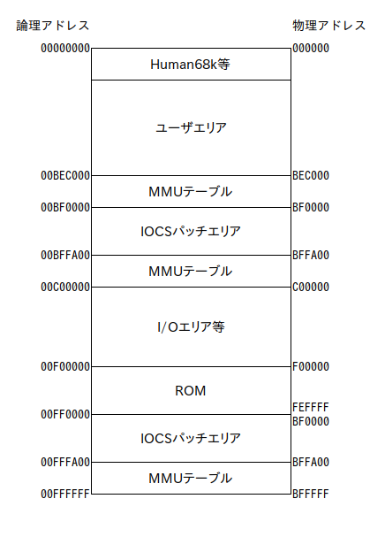

# 030SYSpatch.x
MC68030を搭載したX68000シリーズに040SYSpatch.x互換のMMU環境を提供するデバイスドライバです。

## 概要
MC68EC030からMC68030へ換装したX68030や、MC68030アクセラレータを搭載したX68000に、040SYSpatch.xの拡張IOCSと互換性のあるMMU環境を提供します。

本デバイスドライバには次の2種類があります。
  
* 030SYSpatch.x…IOCSをRAM上に展開してパッチを行います。  
version 2.10からは、040SYSpatch.x環境とメモリ配置で互換を取るようにしたので、CONDRV.SYS等のメモリを最後尾から確保するソフトウェア使用時に、040turbo環境とバッファの共用が可能になりました。
* _30SYSpatch.x…MMU環境のみを提供します。X68000用MC68030アクセラレータでも使用可能です。  
version 2.10からは、MMUテーブル生成バッファを内蔵し当該領域へのライトプロテクト処理を止め常駐サイズの最小化を図りました。その代償にファイルサイズが大きくなっています。

## いわゆるFC2ピンカットについて
NetBSD/x68kでX Window Systemを動作させるためにFC2ピンをカットしている環境では、全領域をユーザモードでアクセス可能になってしまいますが、030SYSpatch.x（_30SYSpatch.x）を使うことでFC2カット前と同様のスーパーバイザ領域の設定が有効になります。  
元々は040SYSpatch.xを真似たジョークソフトでしたが、FC2ピンカットの影響を排除できるソフトウェアとしての意味を持つようになりました。

## メモリマップ
メモリを増設して12MBにしている場合、メモリマップは次のようになります。  
  
_30SYSpatch.xでは、表中のIOCSパッチエリアとMMUテーブルは存在せず、MMUテーブルはHuman68k等となっている領域に格納されます。

## 余談
030SYSpatch.xを使用する環境でベンチマークを行うと、使用していない環境より高速な結果が得られることがあるので注意してください。これは、IOCS ROMがRAM上に展開されノーウェイトになるためす。